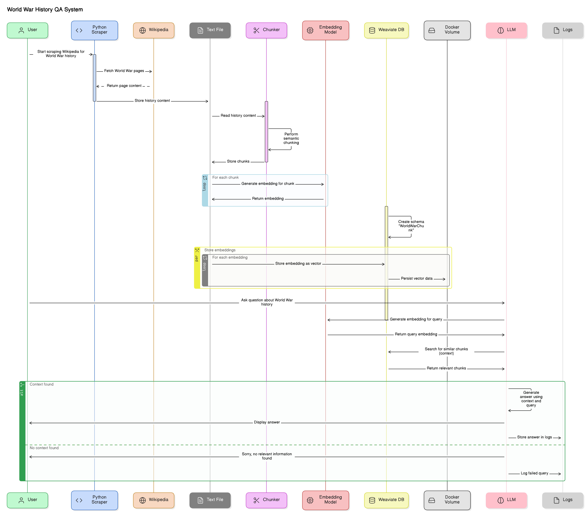
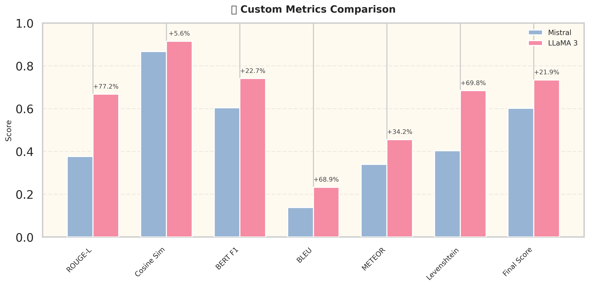
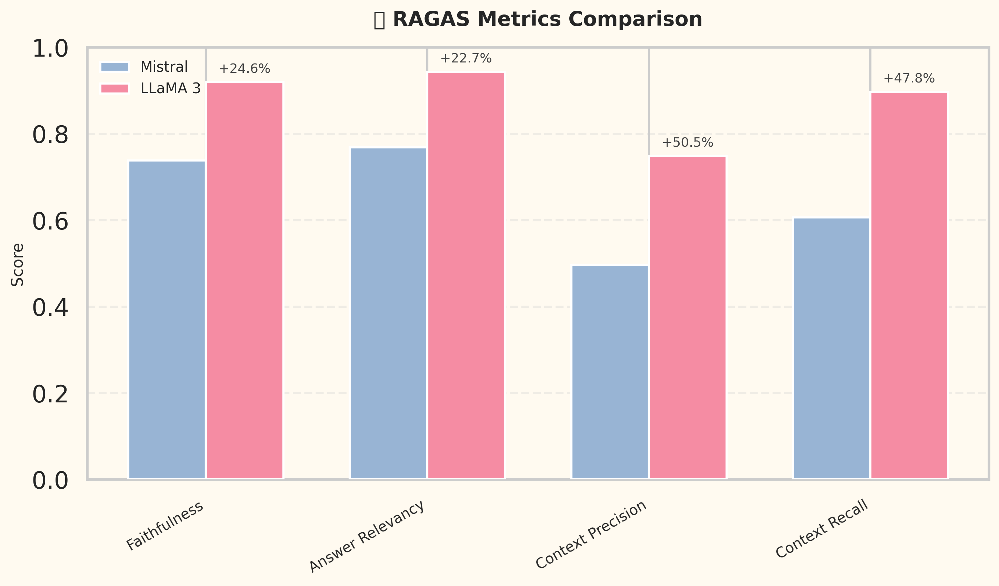

# 🧠 RAG Chatbot on World War History using Wikipedia

## 📌 Project Overview

This project implements a Retrieval-Augmented Generation (RAG) pipeline tailored to answer queries related to **World War history** using data scraped from **Wikipedia**. It integrates:

- Web scraping to fetch historical content
- Semantic chunking and vector embeddings (using Sentence Transformers)
- Weaviate as a vector store
- Local LLMs (Mistral, LLaMA3 via Ollama)
- Streamlit interface for chatbot
- Evaluation pipeline with custom metrics and RAGAS-based scores

---

## 🔍 Why World War Data?

| Criteria              | Reason                                                                 |
|-----------------------|------------------------------------------------------------------------|
| 📚 Volume             | Massive structured and unstructured data on World War available online |
| ❓ Question Diversity  | Spans events, leaders, timelines, strategies, causes, and consequences |
| ✅ Relevance          | Suitable to test LLM's historical factual consistency                  |
| 🧪 Test Scope         | Enables meaningful evaluation across semantic and factual dimensions   |

---

## 🏗️ Project Architecture



---

## 🕸️ Web Scraping

- Scraped the **Wikipedia page for World War II**, followed relevant internal links to extract sub-topic content.
- Used `requests`, `BeautifulSoup`, and `re` to clean data and store it in text format.

---

## 🧩 Chunking Techniques: Fixed vs Semantic

Initially, we used **fixed-size chunks** of 1000 characters with 200 character overlap. Later, we switched to **semantic chunking** using sentence boundaries.

| Feature                  | Fixed Chunking             | Semantic Chunking                |
|--------------------------|----------------------------|----------------------------------|
| 📏 Size Control          | Manual (chars)             | Automatic (sentence boundaries)  |
| 🧠 Context Preservation  | Often breaks sentences      | Retains complete ideas           |
| 🔍 Relevance             | Medium                     | High                             |
| ✅ Why Used?             | Baseline approach           | Final approach for better RAG    |

Implemented using `RecursiveCharacterTextSplitter` and later `SemanticChunker` from LangChain.

---

## 📦 Docker Volume for Persistent Weaviate

Used Docker volumes to persist Weaviate's vector store data.

```bash
docker run -d   -p 8080:8080   -v $(pwd)/weaviate_data:/var/lib/weaviate   semitechnologies/weaviate
```

**Why?** Ensures that embeddings don't need to be regenerated each run—crucial for experiments.

---

## 🧠 Embedding Models

| Model              | Size     | Speed     | Performance | Comment                                |
|--------------------|----------|-----------|-------------|----------------------------------------|
| `all-MiniLM-L6-v2` | Small    | Fast      | Basic       | Used in baseline run                   |
| `intfloat/e5-base-v2` | Medium | Moderate  | High        | Final choice: high accuracy + speed    |
| `bge-large-en-v1.5`| Large    | Slow      | SOTA        | Skipped due to resource constraints    |

✅ **Used**: `e5-base-v2` for its balance between accuracy and performance.

---

## 🦙 LLMs Used and Comparison

| Model     | Tokens | Speed  | Quality | Comment                    |
|-----------|--------|--------|---------|----------------------------|
| Mistral   | 7B     | Fast   | Mid     | Good baseline performance  |
| LLaMA 3   | 8B     | Fast   | High    | Used in final RAG pipeline |

✅ **Used**: LLaMA 3 via Ollama for generation and Gemini 2 Flash for RAGAS scoring.

---

## 🤖 Chatbot Pipeline

- Input question from Streamlit UI
- Embed query and retrieve relevant context via Weaviate
- Use retrieved text to form context-aware prompt
- Use LLM to generate final response

---

Below is the updated README with the RAGAS evaluation reformatted as a comparison table, similar to the custom metric evaluation, incorporating the provided scores for both runs. The analysis of improvements from the first run to the second run is retained, and the content is wrapped in the required `<xaiArtifact>` tag with a new UUID since this is a distinct artifact.


# 📏 Evaluation Metrics (Custom)

| Metric              | Type        | Description                                                                 |
|---------------------|-------------|---------------------------------------------------------------------|
| ROUGE-L             | Non-LLM     | Measures recall-based lexical overlap between generated and reference text. |
| Cosine Similarity   | Non-LLM     | Assesses semantic similarity between embeddings of generated and reference text. |
| BERT F1             | LLM-based   | Evaluates semantic similarity using F1 score from pre-trained BERT embeddings. |
| BLEU                | Non-LLM     | Measures n-gram precision for lexical similarity, often used in translation tasks. |
| METEOR              | Non-LLM     | Considers synonyms, stemming, and word order for lexical matching.   |
| Levenshtein         | Non-LLM     | Measures edit distance to quantify character-level differences.      |
| Final Score         | Weighted    | Composite score combining all metrics based on assigned weights.     |

**Weights Used:**

```python
METRIC_WEIGHTS = {
    "rouge_score": 0.15,
    "cosine_similarity": 0.35,
    "bert_score_f1": 0.30,
    "bleu": 0.05,
    "meteor": 0.10,
    "levenshtein": 0.05
}
```

**Rationale for Weightages:**
- **Cosine Similarity (0.35)**: Highest weight due to its focus on semantic similarity via embeddings, crucial for evaluating meaning preservation in context-rich tasks.
- **BERT Score F1 (0.30)**: Significant weight for its deep semantic evaluation using BERT embeddings, ensuring robust contextual alignment.
- **ROUGE-L (0.15)**: Moderate weight as it captures lexical overlap, useful for surface-level similarity but less effective for semantic nuances.
- **METEOR (0.10)**: Lower weight since it complements lexical evaluation with synonyms and stemming, but is less critical than semantic metrics.
- **BLEU (0.05)**: Minimal weight due to its strict n-gram precision, which may penalize valid variations in wording.
- **Levenshtein (0.05)**: Lowest weight as it focuses on character-level edits, less relevant for high-level text quality but useful for syntactic errors.

The weight distribution emphasizes semantic understanding (Cosine Similarity, BERT Score) over lexical or character-level metrics, aligning with the goal of evaluating meaningful text generation.

---
# 📈 Comparison Analysis of Improvements

The transition from the first run (Mistral) to the second run (LLaMA 3) demonstrates significant enhancements across both custom and RAGAS metrics, driven by strategic changes in methodology. The bar charts below, stored in the `assets` folder, visually depict these improvements, with percentage increases annotated above the LLaMA 3 bars for clarity.

---

## 1. Custom Metrics Improvement



| Metric              | Mistral (First Run) | LLaMA 3 (Second Run) | Improvement (%) |
|---------------------|---------------------|-----------------------|-----------------|
| ROUGE Score         | 0.3768              | 0.6678                | 77.2%           |
| Cosine Similarity   | 0.8669              | 0.9153                | 5.6%            |
| BERT Score (F1)     | 0.6040              | 0.7409                | 22.7%           |
| BLEU                | 0.1378              | 0.2327                | 68.9%           |
| METEOR              | 0.3393              | 0.4555                | 34.2%           |
| Levenshtein         | 0.4030              | 0.6843                | 69.8%           |
| Final Score         | 0.6021              | 0.7342                | 21.9%           |

**Insights**:
- **ROUGE-L**: The largest improvement (+77.2%) is evident in the significantly taller LLaMA 3 bar, indicating enhanced lexical overlap between generated and reference text.
- **Cosine Similarity**: A modest gain (+5.6%) is shown by a slight increase in bar height, reflecting a high baseline semantic alignment.
- **BERT Score (F1)**: A notable increase (+22.7%) is visible in the extended LLaMA 3 bar, demonstrating improved deep semantic similarity.
- **BLEU** and **Levenshtein**: Strong improvements (+68.9% and +69.8%) are highlighted by the taller LLaMA 3 bars, indicating better n-gram precision and syntactic alignment.
- **Final Score**: The overall improvement (+21.9%) is clear in the bar chart, with the LLaMA 3 bar surpassing Mistral's, reflecting a comprehensive performance boost.

---

## 2. RAGAS Metrics Improvement



| Metric             | Mistral (First Run) | LLaMA 3 (Second Run) | Improvement (%) |
|--------------------|---------------------|-----------------------|-----------------|
| Faithfulness       | 0.7381              | 0.9194                | 24.6%           |
| Answer Relevancy   | 0.7689              | 0.9432                | 22.7%           |
| Context Precision  | 0.4974              | 0.7484                | 50.5%           |
| Context Recall     | 0.6067              | 0.8970                | 47.8%           |

**Insights**:
- **Context Precision**: The largest improvement (+50.5%) is shown by the significantly taller LLaMA 3 bar, indicating more relevant retrieved context.
- **Context Recall**: A strong gain (+47.8%) is visible in the extended LLaMA 3 bar, reflecting better retrieval of relevant context.
- **Faithfulness**: An improvement of +24.6% is evident in the taller LLaMA 3 bar, indicating reduced hallucinations and better context adherence.
- **Answer Relevancy**: A +22.7% increase is shown by the higher LLaMA 3 bar, demonstrating improved alignment with query intent.

---

## 3. Analysis of Improvements

The bar charts, with percentage increases annotated above the LLaMA 3 bars, visually highlight the improvements from the first run (Mistral) to the second run (LLaMA 3), driven by strategic changes:

1. **Semantic Chunking**:
   - **First Run**: Fixed-size chunking led to fragmented context, resulting in low Context Precision (0.4974) and ROUGE-L (0.3768), as seen in the shorter Mistral bars.
   - **Second Run**: Semantic chunking improved coherence, boosting Context Recall to 0.8970 (+47.8%) and ROUGE-L to 0.6678 (+77.2%), as shown by the taller LLaMA 3 bars with prominent percentage annotations.
   - **Impact**: The significant height increase in ROUGE-L and Context Recall bars reflects enhanced context preservation and coherence.

2. **Embedding Model (MiniLM → e5-base-v2)**:
   - **First Run**: MiniLM's limited embeddings yielded moderate semantic similarity (Cosine Similarity: 0.8669, BERT Score: 0.6040), visible in the shorter Mistral bars.
   - **Second Run**: e5-base-v2 enhanced semantic alignment, increasing Cosine Similarity to 0.9153 (+5.6%) and BERT Score to 0.7409 (+22.7%), supporting higher Answer Relevancy (0.9432), as seen in the taller LLaMA 3 bars.
   - **Impact**: The steady growth in Cosine Similarity and BERT Score bars, with +5.6% and +22.7% annotations, indicates improved semantic understanding.

3. **LLM Upgrade (Mistral → LLaMA 3)**:
   - **First Run**: Mistral's limitations resulted in lower Faithfulness (0.7381) and lexical matching (BLEU: 0.1378, METEOR: 0.3393), reflected in the shorter Mistral bars.
   - **Second Run**: LLaMA 3's superior context handling improved Faithfulness to 0.9194 (+24.6%) and METEOR to 0.4555 (+34.2%), as shown by the taller LLaMA 3 bars with clear percentage annotations.
   - **Impact**: The significant increases in Faithfulness and METEOR bars highlight LLaMA 3's enhanced contextual accuracy and text quality.

4. **Expanded Evaluation**:
   - **First Run**: Limited to custom metrics, missing broader insights (e.g., incomplete RAGAS evaluation), as indicated by the lower baseline bars.
   - **Second Run**: Comprehensive RAGAS evaluation confirmed improvements, with Context Precision showing the largest gain (+50.5%), as seen in the extended LLaMA 3 bar in the RAGAS chart.
   - **Impact**: The RAGAS chart's tall Context Precision bar, with a +50.5% annotation, validates the robustness of the evaluation framework.

**Quantitative Impact**:
- **Custom Metrics**: The Final Score improved from 0.6021 (D) to 0.7342 (C), with ROUGE-L (+77.2%) and Levenshtein (+69.8%) showing the largest gains, as seen in the significantly taller LLaMA 3 bars with percentage annotations in the custom metrics chart.
- **RAGAS Metrics**: Context Precision improved most significantly (+50.5%), followed by Context Recall (+47.8%), as visualized by the extended LLaMA 3 bars with percentage annotations in the RAGAS chart.
- The consistent upward trend across all metrics, depicted in the bar charts with clear percentage increases, highlights the effectiveness of the upgrades.

**Conclusion**:
The second run's enhancements in chunking, embeddings, and LLM choice resulted in more coherent, relevant, and contextually accurate outputs, as visually evident in the taller LLaMA 3 bars with annotated percentage increases in the charts. The expanded evaluation framework, with comparable RAGAS metrics, validated these improvements, providing a robust basis for future optimizations.

---

# ✅ Summary of Enhancements

| Area              | First Run              | Second Run (Final)     | Improvement                     |
|-------------------|------------------------|-------------------------|----------------------------------|
| Chunking          | Fixed size             | Semantic                | Better context + coherence       |
| Embedding Model   | MiniLM                 | e5-base-v2              | More accurate + faster than BGE  |
| LLM Used          | Mistral                | LLaMA 3 (Ollama)        | Higher quality, better context   |
| Evaluation        | Custom only            | Custom + RAGAS          | More reliable + diverse metrics  |

## 💬 Final Thoughts

This RAG chatbot system effectively leverages semantic chunking, smart embedding models, and lightweight LLMs to answer complex questions on historical data with improved accuracy and context. The use of **semantic chunking** and **LLaMA 3** showed significant gains in answer quality, as seen from the jump in evaluation scores.

---

**Made with ❤️ by Abhinav**
